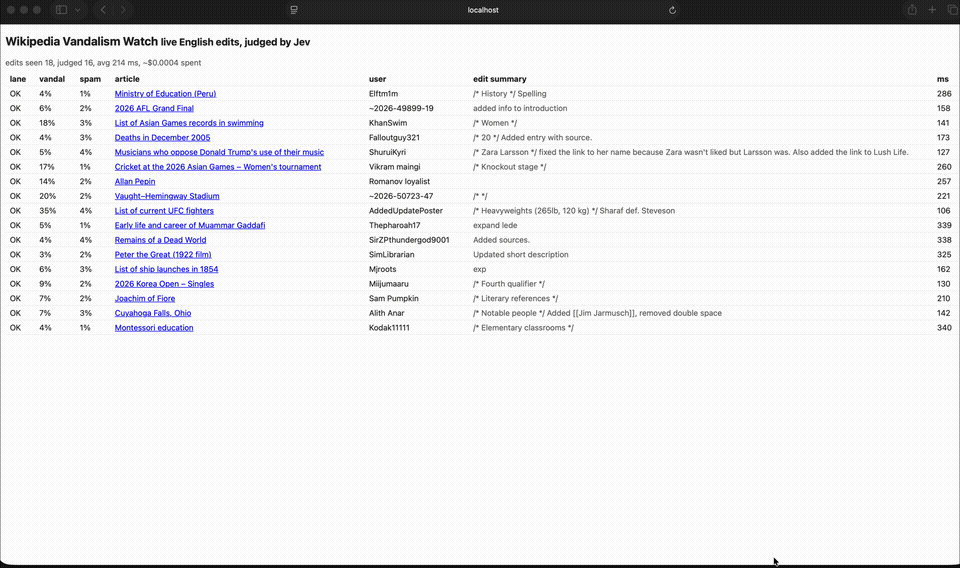

# Wikipedia Vandalism Watch

Live English Wikipedia edits, each judged by [Jev](https://typesafe.ai) in one call: is it vandalism, is it spam, and how sure. Two files, no packages.



[Full recording](docs/demo.mov) (49 seconds).

## You need

- Node 18 or newer. Check with `node --version`. Get it from https://nodejs.org if missing.
- A TypeSafe API key. Sign up at https://typesafe.ai and copy the key from your dashboard.

Nothing to install. No `npm install`.

## Run

```
git clone https://github.com/hfmsio/jev-wiki-watch.git
cd jev-wiki-watch
TYPESAFE_API_KEY=your_key node server.mjs
```

Open http://localhost:8000. Rows appear within seconds.

## How it works

1. The browser listens to the public Wikipedia edit stream (no key needed).
2. For each human edit to an article it fetches the diff from the Wikipedia API.
3. It sends the diff plus title, user and edit summary to Jev with two yes/no questions.
4. Jev returns a probability for each. The page sorts the edit into a lane:

| lane | rule |
| --- | --- |
| FLAG | vandalism or spam at 80% or more |
| REVIEW | 40% to 80%, a human should look |
| OK | below 40% |

The header shows edits seen, edits judged, average response time and cost so far.

## Files

- `server.mjs` serves the page and forwards `/jev` calls to TypeSafe with your key. The key never reaches the browser.
- `index.html` does everything else.

## Why a server at all

The TypeSafe API does not allow calls straight from a browser page, so the page needs one tiny relay. Wikipedia's stream and API do allow it, so the browser talks to them directly.

## Notes

- Only English Wikipedia, main articles, non-bot edits.
- At most 4 edits are judged at once. Extra edits during a burst are skipped, not queued.
- Thresholds live in `index.html` in the `lane` function. Change them to taste.
- Jev questions are in the `questions` object at the top of the script. Add a third question and a column to extend the demo.
